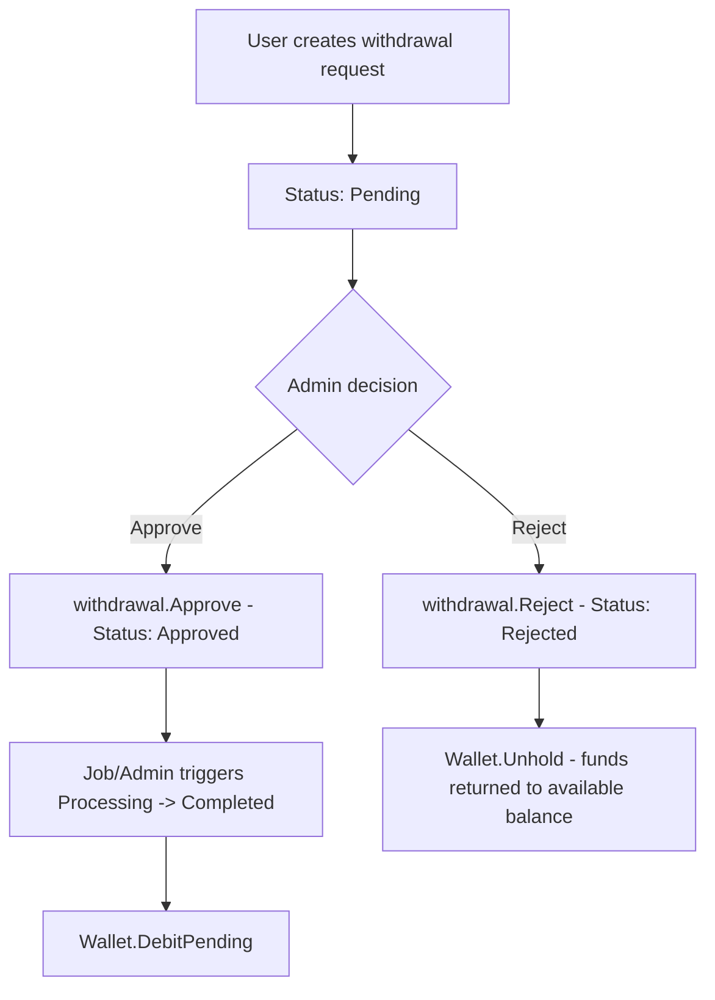

# 10 - Payment Administration

Admin endpoints for viewing payment summaries, platform wallet, transactions, escrows, and managing withdrawal requests.

---

## Withdrawal Approval Flow



---

## Endpoints

| # | Method | Route | Description |
|---|--------|-------|-------------|
| 1 | `GET` | `api/admin/payments/summary` | Payment summary statistics |
| 2 | `GET` | `api/admin/payments/platform-wallet` | Platform wallet balance |
| 3 | `GET` | `api/admin/payments/transactions` | List all transactions (paged) |
| 4 | `GET` | `api/admin/payments/transactions/{transactionId}` | Get transaction by ID |
| 5 | `GET` | `api/admin/payments/escrows` | List all escrows (paged) |
| 6 | `GET` | `api/admin/payments/escrows/{escrowId}` | Get escrow by ID |
| 7 | `GET` | `api/admin/payments/withdrawals` | List all withdrawals (paged) |
| 8 | `GET` | `api/admin/payments/withdrawals/{withdrawalId}` | Get withdrawal by ID |
| 9 | `POST` | `api/admin/payments/withdrawals/{withdrawalId}/approve` | Approve a withdrawal |
| 10 | `POST` | `api/admin/payments/withdrawals/{withdrawalId}/reject` | Reject a withdrawal |

---

## 1. Payment Summary

**Query Parameters:**

| Parameter | Type | Description |
|-----------|------|-------------|
| `from` | `DateTime?` | Start of date range filter. |
| `to` | `DateTime?` | End of date range filter. |

**Response: `PaymentSummaryDto`**

| Field | Type | Description |
|-------|------|-------------|
| `completedPayments` | `int` | Count of transactions with `Type = Payment` and `Status = Completed`. |
| `failedPayments` | `int` | Count of transactions with `Type = Payment` and `Status = Failed`. |
| `walletTopUps` | `int` | Count of deposit transactions containing `[WalletTopUp]` in description. |
| `withdrawalPendingCount` | `int` | Count of withdrawals with `Status = Pending`. |
| `holdingEscrowCount` | `int` | Count of escrows with `Status = Holding`. |
| `releasedEscrowTotal` | `decimal` | Sum of escrow amounts with `Status = ReleasedToSeller`. |
| `refundedEscrowTotal` | `decimal` | Sum of escrow amounts with `Status = RefundedToBuyer`. |

---

## 2. Platform Wallet

No parameters. Returns the single wallet with `WalletType.Platform`.

**Response: `WalletSummaryDto`**

| Field | Type | Description |
|-------|------|-------------|
| `walletId` | `Guid` | Wallet identifier. |
| `currency` | `string` | Currency code. |
| `availableBalance` | `decimal` | Funds available for use. |
| `pendingBalance` | `decimal` | Funds held/pending. |
| `totalBalance` | `decimal` | Total balance. |
| `isActive` | `bool` | Wallet active status. |
| `updatedAt` | `DateTime` | Last update timestamp. |

---

## 3. Transactions (List)

**Filter Parameters (`AdminTransactionFilterParameters`):**

| Parameter | Type | Description |
|-----------|------|-------------|
| `status` | `string?` | Filter by `TransactionStatus` (e.g., `"completed"`, `"failed"`). |
| `type` | `string?` | Filter by `TransactionType` (e.g., `"payment"`, `"deposit"`). |
| `userId` | `Guid?` | Filter by user. |
| `orderId` | `Guid?` | Filter by order. |
| `page` | `int` | Page number (from `PagedParameters`). |
| `pageSize` | `int` | Page size (from `PagedParameters`). |

Ordered by `CreatedAt` descending. Returns `PagedList<PaymentTransactionDto>`.

---

## 5. Escrows (List)

**Filter Parameters (`AdminEscrowFilterParameters`):**

| Parameter | Type | Description |
|-----------|------|-------------|
| `status` | `string?` | Filter by `EscrowStatus` (e.g., `"holding"`, `"released_to_seller"`, `"refunded_to_buyer"`). |
| `orderId` | `Guid?` | Filter by order. |
| `buyerId` | `Guid?` | Filter by buyer (via `Order.BuyerId`). |
| `sellerId` | `Guid?` | Filter by seller (via `Order.SellerId`). |
| `page` | `int` | Page number. |
| `pageSize` | `int` | Page size. |

Ordered by `HeldAt` descending. Returns `PagedList<EscrowDto>`.

---

## 7. Withdrawals (List)

**Filter Parameters (`AdminWithdrawalFilterParameters`):**

| Parameter | Type | Description |
|-----------|------|-------------|
| `status` | `string?` | Filter by `WithdrawalStatus`. |
| `userId` | `Guid?` | Filter by user. |
| `page` | `int` | Page number. |
| `pageSize` | `int` | Page size. |

Ordered by `CreatedAt` descending. Returns `PagedList<WithdrawalRequestDto>`.

---

## 9. Approve Withdrawal

**Route:** `POST api/admin/payments/withdrawals/{withdrawalId}/approve`

No request body.

**Handler Logic (`ApproveWithdrawalCommandHandler`):**

1. Load `WithdrawalRequest` by ID.
2. Call `withdrawal.Approve(adminId, nowUtc)` which transitions status from `Pending` to `Approved`.
3. Funds remain in held state. A background job or admin subsequently triggers `MarkAsProcessing` -> `MarkAsCompleted` -> `Wallet.DebitPending`.
4. Save changes.

---

## 10. Reject Withdrawal

**Route:** `POST api/admin/payments/withdrawals/{withdrawalId}/reject`

**Request Body:**

```json
{
  "reason": "Insufficient documentation"
}
```

**Handler Logic (`RejectWithdrawalCommandHandler`):**

1. Load `WithdrawalRequest` by ID.
2. Call `withdrawal.Reject(adminId, reason, nowUtc)` which transitions status to `Rejected`.
3. **Unhold funds:** loads the user's `Wallet` and calls `wallet.Unhold(amount, ...)` to return the held amount to the available balance.
4. Save changes.

---

## Withdrawal Status Values

| Status | Description |
|--------|-------------|
| `pending` | Awaiting admin review. |
| `approved` | Admin approved; awaiting processing. |
| `processing` | Transfer in progress. |
| `completed` | Successfully transferred. |
| `rejected` | Admin rejected; funds unhold. |
| `cancelled` | User cancelled before approval. |

---

## Key Source Files

| File | Path |
|------|------|
| Payment summary | `src/core/OIO.Application/Context/PaymentContext/Queries/Admins/GetPaymentSummary/GetPaymentSummaryQuery.cs` |
| Platform wallet | `src/core/OIO.Application/Context/PaymentContext/Queries/Admins/GetPlatformWallet/GetPlatformWalletQuery.cs` |
| Admin transactions | `src/core/OIO.Application/Context/PaymentContext/Queries/Admins/GetAdminTransactions/GetAdminTransactionsQuery.cs` |
| Admin escrows | `src/core/OIO.Application/Context/PaymentContext/Queries/Admins/GetAdminEscrows/GetAdminEscrowsQuery.cs` |
| Admin withdrawals | `src/core/OIO.Application/Context/PaymentContext/Queries/Admins/GetAdminWithdrawals/GetAdminWithdrawalsQuery.cs` |
| Approve/Reject commands | `src/core/OIO.Application/Context/PaymentContext/Commands/Withdrawals/ProcessWithdrawalCommands.cs` |
| DTOs | `src/core/OIO.Application/Context/PaymentContext/DTOs/PaymentSummaryDto.cs`, `WalletSummaryDto.cs` |
| Endpoint URL definitions | `src/presentation/OIO.Api/Common/ApiEndpoint.Url.cs` (class `AdminPayments`) |
