# 15 - Admin Operations

## Overview

Administrative operations provide platform governance across user management, role/permission control, content moderation, verification review, seller oversight, item curation, and payment administration. All admin endpoints live under the `api/admin` and `api/admin/payments` route prefixes and require admin-level permissions defined in `App.Permissions.Catalogs.Admin`.

The admin role (level 100) has access to **all** permissions in the system. The inspector role (level 60) has limited warehouse-related permissions. All 24 admin permissions are classified as **critical permissions** -- only users with admin-level role can grant them.

---

## Sub-Group Overview

```mermaid
---
config:
  layout: elk
---
flowchart TD
    Admin["Admin Operations<br/>55 endpoints"]

    Admin --> UM["User Management<br/>7 endpoints"]
    Admin --> RP["Role & Permission<br/>8 endpoints"]
    Admin --> VR["Verification Review<br/>4 endpoints"]
    Admin --> SP["Seller Profile Review<br/>3 endpoints"]
    Admin --> IR["Item Review<br/>6 endpoints"]
    Admin --> AM["Auction Moderation<br/>5 endpoints"]
    Admin --> MO["Moderation & Reports<br/>9 endpoints"]
    Admin --> TM["Terms Management<br/>3 endpoints"]
    Admin --> PA["Payment Admin<br/>10 endpoints"]

    UM --- um1["POST create user"]
    UM --- um2["GET list / by ID"]
    UM --- um3["PATCH status / unlock"]
    UM --- um4["POST risk-flag"]
    UM --- um5["DELETE user"]

    RP --- rp1["GET roles / permissions"]
    RP --- rp2["POST assign / DELETE revoke role"]
    RP --- rp3["POST grant / DELETE revoke perm"]
    RP --- rp4["PUT deny perm / toggle perm"]

    VR --- vr1["GET pending / by ID"]
    VR --- vr2["POST approve / reject"]

    SP --- sp1["GET profiles"]
    SP --- sp2["POST verify / reject"]

    IR --- ir1["GET queue / detail / history"]
    IR --- ir2["POST assign / approve / reject"]

    AM --- am1["PUT curation"]
    AM --- am2["POST sealed-bid reveal"]
    AM --- am3["POST emergency trigger/resolve"]

    MO --- mo1["GET reports / alerts"]
    MO --- mo2["POST assign / resolve / escalate"]
    MO --- mo3["POST flag user / auction"]
    MO --- mo4["POST cancel bid"]

    TM --- tm1["GET all terms"]
    TM --- tm2["POST create terms"]
    TM --- tm3["PUT activate terms"]

    PA --- pa1["GET withdrawals / transactions"]
    PA --- pa2["GET escrows / summary / wallet"]
    PA --- pa3["POST approve / reject withdrawal"]
```

---

## Permission Matrix (24 Admin Permissions)

| Category | Permission Code | Description |
|---|---|---|
| **User Management** | `admin:users:read` | List and view user details |
| | `admin:users:manage` | Create users, change status, unlock, delete |
| | `admin:users:delete` | Delete user accounts |
| **Role Management** | `admin:roles:read` | List all roles with permissions |
| | `admin:roles:assign` | Assign role to user |
| | `admin:roles:revoke` | Revoke role from user |
| **Permission Management** | `admin:permissions:read` | List all permissions |
| | `admin:permissions:grant` | Grant direct permission to user |
| | `admin:permissions:revoke` | Revoke direct permission from user |
| | `admin:permissions:deny` | Deny permission (overrides role grant) |
| | `admin:permissions:manage` | Toggle permission in role definition |
| **Settings** | `admin:settings:read` | Read system settings |
| | `admin:settings:manage` | Update system settings |
| **Terms** | `admin:terms:read` | List terms documents |
| | `admin:terms:manage` | Create and activate terms documents |
| **Verifications** | `admin:verifications:read` | List pending verifications, view by ID |
| | `admin:verifications:manage` | Approve/reject identity verifications |
| **Seller Profiles** | `admin:seller-profiles:read` | List seller profiles |
| | `admin:seller-profiles:manage` | Verify/reject seller profiles |
| **Item Moderation** | `admin:items:read` | View review queue, item detail, reports, alerts |
| | `admin:items:manage` | Approve/reject items, assign reviewers, manage auctions, resolve disputes/reports/alerts |
| **Payment Operations** | `admin:payments:read` | View transactions, escrows, withdrawals, summary, platform wallet |
| | `admin:payments:manage` | Approve/reject withdrawals |

---

## Roles

| Role | Level | Admin Permissions Scope |
|---|---|---|
| **admin** | 100 | All permissions (including all 24 admin permissions) |
| **inspector** | 60 | `warehouse:shipments:read`, `warehouse:item:inspect`, `warehouse:item:store` + basic profile/media |
| **seller** | 50 | Item/auction management, media, own profile -- no admin permissions |
| **bidder** | 50 | Bidding, buy-now, auto-bid, watchlist -- no admin permissions |
| **user** | 50 | Profile, watchlist, media upload, terms, verification -- no admin permissions |

Role level determines escalation prevention: an actor can only manage users with a **strictly lower** max role level. Admin (100) can manage all others. Inspector (60) can manage seller/bidder/user (50). No role can assign or revoke a role at equal or higher level.

---

## Subflow Index

| # | File | Topic |
|---|---|---|
| 1 | [01-user-management.md](01-user-management.md) | Create, list, view, change status, unlock, risk-flag, delete users |
| 2 | [02-role-permission.md](02-role-permission.md) | Roles, permissions, assign/revoke/grant/deny/toggle |
| 3 | [03-verification-review.md](03-verification-review.md) | Identity verification admin review flow |
| 4 | [04-seller-profile-review.md](04-seller-profile-review.md) | Seller profile verification and rejection |
| 5 | [05-item-review.md](05-item-review.md) | Item moderation review queue and approval flow |

---

## All Admin Endpoints Summary

| # | Route | Method | Permission |
|---|---|---|---|
| **User Management** | | | |
| 1 | `api/admin/users` | POST | `admin:users:manage` |
| 2 | `api/admin/users` | GET | `admin:users:read` |
| 3 | `api/admin/users/{userId}` | GET | `admin:users:read` |
| 4 | `api/admin/users/{userId}/status` | PATCH | `admin:users:manage` |
| 5 | `api/admin/users/{userId}/unlock` | PATCH | `admin:users:manage` |
| 6 | `api/admin/users/{userId}` | DELETE | `admin:users:manage` |
| 7 | `api/admin/users/{userId}/risk-flags` | POST | `admin:users:manage` |
| **Role & Permission** | | | |
| 8 | `api/admin/roles` | GET | `admin:roles:read` |
| 9 | `api/admin/permissions` | GET | `admin:permissions:read` |
| 10 | `api/admin/users/{userId}/roles/{role}` | POST | `admin:roles:assign` |
| 11 | `api/admin/users/{userId}/roles/{role}` | DELETE | `admin:roles:revoke` |
| 12 | `api/admin/users/{userId}/permissions/{permission}` | POST | `admin:permissions:grant` |
| 13 | `api/admin/users/{userId}/permissions/{permission}` | DELETE | `admin:permissions:revoke` |
| 14 | `api/admin/users/{userId}/permissions/{permission}` | PUT | `admin:permissions:deny` |
| 15 | `api/admin/roles/{role}/permissions/{permission}` | PUT | `admin:permissions:manage` |
| **Terms Management** | | | |
| 16 | `api/admin/terms` | GET | `admin:terms:read` |
| 17 | `api/admin/terms` | POST | `admin:terms:manage` |
| 18 | `api/admin/terms/{id}/activate` | PUT | `admin:terms:manage` |
| **Verification Review** | | | |
| 19 | `api/admin/verifications` | GET | `admin:verifications:read` |
| 20 | `api/admin/verifications/{verificationId}` | GET | `admin:verifications:read` |
| 21 | `api/admin/verifications/{verificationId}/approve` | POST | `admin:verifications:manage` |
| 22 | `api/admin/verifications/{verificationId}/reject` | POST | `admin:verifications:manage` |
| **Seller Profile Review** | | | |
| 23 | `api/admin/seller-profiles` | GET | `admin:seller-profiles:read` |
| 24 | `api/admin/seller-profiles/{id}/verify` | POST | `admin:seller-profiles:manage` |
| 25 | `api/admin/seller-profiles/{id}/reject` | POST | `admin:seller-profiles:manage` |
| **Item Moderation** | | | |
| 26 | `api/admin/items/review-queue` | GET | `admin:items:read` |
| 27 | `api/admin/items/{itemId}` | GET | `admin:items:read` |
| 28 | `api/admin/items/{itemId}/assign` | POST | `admin:items:manage` |
| 29 | `api/admin/items/{itemId}/approve` | POST | `admin:items:manage` |
| 30 | `api/admin/items/{itemId}/reject` | POST | `admin:items:manage` |
| 31 | `api/admin/items/{itemId}/reviews` | GET | `admin:items:read` |
| **Auction Moderation** | | | |
| 32 | `api/admin/auctions/{auctionId}/curation` | PUT | `admin:items:manage` |
| 33 | `api/admin/auctions/{auctionId}/sealed-bids/{sealedBidId}/reveal` | POST | `admin:items:manage` |
| 34 | `api/admin/auctions/{auctionId}/emergencies` | POST | `admin:items:manage` |
| 35 | `api/admin/auctions/{auctionId}/emergencies/{emergencyId}/resolve` | POST | `admin:items:manage` |
| 36 | `api/admin/disputes/{disputeId}/resolve` | POST | `admin:items:manage` |
| **Moderation & Reports** | | | |
| 37 | `api/admin/reports` | GET | `admin:items:read` |
| 38 | `api/admin/reports/{reportId}/assign` | POST | `admin:items:manage` |
| 39 | `api/admin/reports/{reportId}/resolve` | POST | `admin:items:manage` |
| 40 | `api/admin/reports/{reportId}/escalate-emergency` | POST | `admin:items:manage` |
| 41 | `api/admin/monitoring-alerts` | GET | `admin:items:read` |
| 42 | `api/admin/monitoring-alerts/{alertId}/acknowledge` | POST | `admin:items:manage` |
| 43 | `api/admin/monitoring-alerts/{alertId}/resolve` | POST | `admin:items:manage` |
| 44 | `api/admin/users/{userId}/risk-flags` | POST | `admin:users:manage` |
| 45 | `api/admin/auctions/{auctionId}/alerts` | POST | `admin:items:manage` |
| 46 | `api/admin/auctions/{auctionId}/bids/{bidId}/cancel` | POST | `admin:items:manage` |
| **Payment Admin** | | | |
| 47 | `api/admin/payments/withdrawals` | GET | `admin:payments:read` |
| 48 | `api/admin/payments/withdrawals/{withdrawalId}` | GET | `admin:payments:read` |
| 49 | `api/admin/payments/withdrawals/{withdrawalId}/approve` | POST | `admin:payments:manage` |
| 50 | `api/admin/payments/withdrawals/{withdrawalId}/reject` | POST | `admin:payments:manage` |
| 51 | `api/admin/payments/transactions` | GET | `admin:payments:read` |
| 52 | `api/admin/payments/transactions/{transactionId}` | GET | `admin:payments:read` |
| 53 | `api/admin/payments/escrows` | GET | `admin:payments:read` |
| 54 | `api/admin/payments/escrows/{escrowId}` | GET | `admin:payments:read` |
| 55 | `api/admin/payments/summary` | GET | `admin:payments:read` |
| 56 | `api/admin/payments/platform-wallet` | GET | `admin:payments:read` |

---

## Source References

- Permissions: `src/core/OIO.Domain/AppDefinitions/AppPermissions.cs`
- Roles: `src/core/OIO.Domain/AppDefinitions/AppRoles.cs`
- Routes: `src/presentation/OIO.Api/Common/ApiEndpoint.Url.cs`
- Endpoint implementations: `src/presentation/OIO.Api/Endpoints/*/Admins/`
