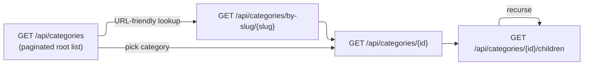

# 16-01 -- Category Browsing

## Overview

Four anonymous endpoints expose the category tree. Clients navigate from a flat/paginated root list, then drill into individual categories by ID or slug, and finally fetch children for hierarchical menus.

---

## Category Navigation Flow



---

## Endpoints

### 1. List All Active Categories

| Property | Value |
|----------|-------|
| Route | `GET api/categories` |
| Auth | Anonymous |
| Handler | `GetAllCategoriesEndpoint` -> `GetAllActiveCategoriesQueryHandler` |
| Response | `200 OK` -- Paged `CategoryDto[]` |

**Query Parameters:**

| Param | Type | Default | Description |
|-------|------|---------|-------------|
| `pageNumber` | int? | 1 | Page number (min 1) |
| `pageSize` | int? | 10 | Page size (max 50) |
| `sortBy` | string? | -- | Sort field (e.g. `name`, `sortOrder`, `createdAt`) |

---

### 2. Get Category by ID

| Property | Value |
|----------|-------|
| Route | `GET api/categories/{categoryId:guid}` |
| Auth | Anonymous |
| Handler | `GetCategoryByIdEndpoint` -> `GetCategoryByIdQueryHandler` |
| Response | `200 OK` -- `CategoryDto` |
| Errors | `404 Not Found` |

---

### 3. Get Category by Slug

| Property | Value |
|----------|-------|
| Route | `GET api/categories/by-slug/{slug}` |
| Auth | Anonymous |
| Handler | `GetCategoryBySlugEndpoint` -> `GetCategoryBySlugQueryHandler` |
| Response | `200 OK` -- `CategoryDto` |
| Errors | `404 Not Found` |

**Slug format:** Lowercase, hyphen-separated, URL-safe string derived from the category name (e.g. `electronics`, `fine-art`). Stored as a `Slug` value object on the `Category` aggregate.

---

### 4. Get Category Children

| Property | Value |
|----------|-------|
| Route | `GET api/categories/{categoryId:guid}/children` |
| Auth | Anonymous |
| Handler | `GetCategoryChildrenEndpoint` -> `GetCategoryChildrenQueryHandler` |
| Response | `200 OK` -- Paged `CategoryDto[]` |

**Query Parameters:**

| Param | Type | Default | Description |
|-------|------|---------|-------------|
| `pageNumber` | int? | 1 | Page number |
| `pageSize` | int? | 10 | Page size (max 50) |
| `sortBy` | string? | -- | Sort field |

---

## CategoryDto

```
CategoryDto(
    Guid     Id,
    Guid?    ParentId,
    string   Name,
    string   Slug,
    string?  Description,
    string?  IconUrl,
    bool     IsActive,
    int      SortOrder,
    string   Path,          // Materialized path e.g. "electronics/phones/smartphones"
    DateTime CreatedAt
)
```

---

## Category Entity Highlights

| Property | Description |
|----------|-------------|
| `ParentId` | Nullable -- root categories have `null` |
| `Slug` | Value object; unique, URL-safe |
| `Path` | `CategoryPath` value object -- materialized path built from parent path + slug |
| `IconStorageRef` / `IconInfo` | Optional icon image stored via media pipeline |
| `IsActive` | Only active categories are returned by public endpoints |
| `SortOrder` | Controls display ordering within the same parent |
| `Children` | Navigation collection for EF Core tree queries |

---

## Source Files

| File | Path |
|------|------|
| Endpoint (list) | `src/presentation/OIO.Api/Endpoints/AuctionContext/Categories/GetAllCategoriesEndpoint.cs` |
| Endpoint (by ID) | `src/presentation/OIO.Api/Endpoints/AuctionContext/Categories/GetCategoryByIdEndpoint.cs` |
| Endpoint (by slug) | `src/presentation/OIO.Api/Endpoints/AuctionContext/Categories/GetCategoryBySlugEndpoint.cs` |
| Endpoint (children) | `src/presentation/OIO.Api/Endpoints/AuctionContext/Categories/GetCategoryChildrenEndpoint.cs` |
| Filter params | `src/core/OIO.Application/Context/AuctionContext/Queries/GetAllActiveCategories/GetAllActiveCategoriresFilterParameters.cs` |
| CategoryDto | `src/core/OIO.Application/Context/AuctionContext/DTOs/CategoryDto.cs` |
| Category entity | `src/core/OIO.Domain/Context/CatalogContext/Aggregates/Categories/Category.cs` |
