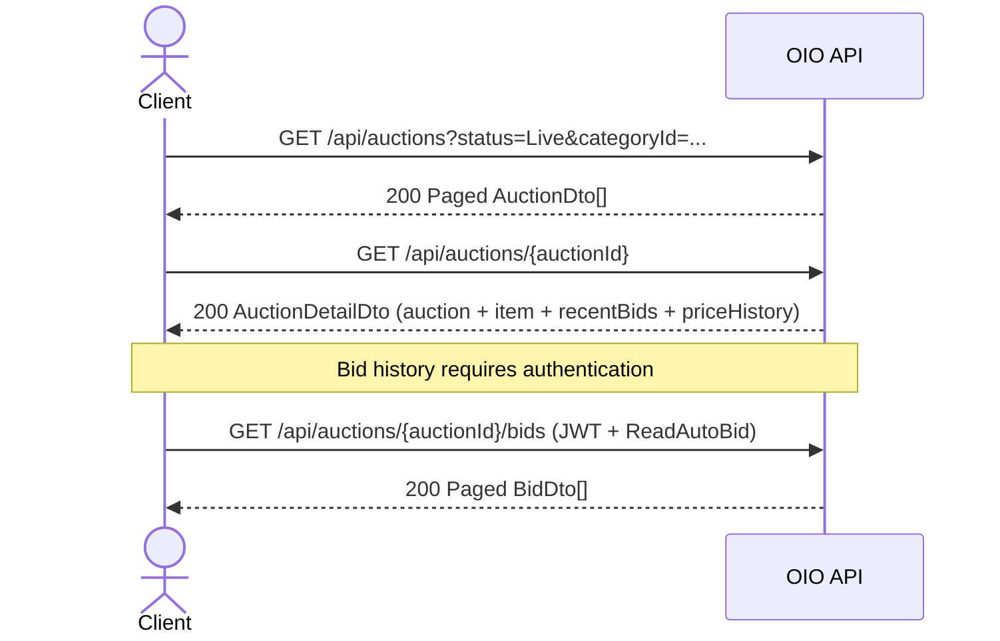

# 16-02 -- Auction Browsing

## Overview

Three endpoints power the public auction experience: a filterable listing, a detail view that bundles the auction with its item and recent bids, and a bid-history endpoint that requires authentication.

---

## Browsing Sequence



---

## Endpoints

### 1. List Auctions

| Property | Value |
|----------|-------|
| Route | `GET api/auctions` |
| Auth | Anonymous |
| Handler | `GetAuctionsEndpoint` -> `GetAuctionsQueryHandler` |
| Response | `200 OK` -- Paged `AuctionDto[]` |

**Filter Parameters (`GetAuctionsFilterParameters`):**

| Param | Type | Description |
|-------|------|-------------|
| `status` | string? | Auction status filter (e.g. `Live`, `Upcoming`, `Ended`) |
| `categoryId` | Guid? | Filter by category |
| `search` | string? | Free-text search on auction/item title |
| `minPrice` | decimal? | Minimum current price |
| `maxPrice` | decimal? | Maximum current price |
| `sortBy` | string? | Sort field (e.g. `endTime`, `currentPrice`, `createdAt`) |
| `endingWithinHours` | int? | Only auctions ending within N hours |
| `isFeatured` | bool? | Filter featured auctions |
| `pageNumber` | int? | Default 1 |
| `pageSize` | int? | Default 10, max 50 |

---

### 2. Get Auction by ID

| Property | Value |
|----------|-------|
| Route | `GET api/auctions/{auctionId:guid}` |
| Auth | Anonymous |
| Handler | `GetAuctionByIdEndpoint` -> `GetAuctionByIdQueryHandler` |
| Response | `200 OK` -- `AuctionDetailDto` |
| Errors | `404 Not Found` |

---

### 3. Get Auction Bids

| Property | Value |
|----------|-------|
| Route | `GET api/auctions/{auctionId:guid}/bids` |
| Auth | Authenticated + `ReadAutoBid` permission |
| Handler | `GetAuctionBidsEndpoint` -> `GetAuctionBidsQueryHandler` |
| Response | `200 OK` -- Paged `BidDto[]` |
| Errors | `404 Not Found` |

**Query Parameters:**

| Param | Type | Description |
|-------|------|-------------|
| `pageNumber` | int? | Default 1 |
| `pageSize` | int? | Default 10, max 50 |
| `sortBy` | string? | Sort field |

---

## DTOs

### AuctionDto

```
AuctionDto(
    Guid      Id,
    Guid      ItemId,
    Guid      SellerId,
    string    AuctionType,
    MoneyDto  StartingPrice,
    MoneyDto? ReservePrice,
    MoneyDto? BuyNowPrice,
    MoneyDto  CurrentPrice,
    MoneyDto  BidIncrement,
    string    Currency,
    DateTime? StartTime,
    DateTime? EndTime,
    DateTime? ActualEndTime,
    DateTime? QualificationStartAt,
    DateTime? QualificationEndAt,
    string    Status,
    Guid?     CurrentWinnerId,
    bool      AutoExtend,
    int       ExtensionMinutes,
    int       ExtensionCount,
    Guid?     AssignedAdminId,
    DateTime? AssignedAt,
    bool      IsFeatured,
    decimal   Priority,
    string    PriorityReason,
    bool      VerifyByPlatform,
    int       RejectionCount,
    int       ViewCount,
    int       BidCount,
    int       WatchCount,
    MoneyDto  MinimumBidAmount,
    bool      IsReserveMet,
    bool      HasBuyNow,
    bool      IsBuyNowReserved,
    DateTime? BuyNowReservedUntil,
    TimeSpan  RemainingTime,
    bool      IsEndingSoon,
    DateTime  CreatedAt
)
```

### AuctionDetailDto

```
AuctionDetailDto(
    AuctionDto                  Auction,
    ItemDto                     Item,
    IReadOnlyList<BidDto>       RecentBids,
    IReadOnlyList<PriceHistoryDto> PriceHistory
)
```

### BidDto

```
BidDto(
    Guid     Id,
    Guid     AuctionId,
    Guid     BidderId,
    MoneyDto Amount,
    bool     IsAutoBid,
    string   Status,
    DateTime CreatedAt
)
```

### PriceHistoryDto

```
PriceHistoryDto(
    MoneyDto  Price,
    string    Type,
    Guid?     BidId,
    DateTime  RecordedAt
)
```

### MoneyDto

```
MoneyDto(decimal Amount, string Currency, string Symbol)
```

---

## Source Files

| File | Path |
|------|------|
| Endpoint (list) | `src/presentation/OIO.Api/Endpoints/AuctionContext/Auctions/GetAuctionsEndpoint.cs` |
| Endpoint (by ID) | `src/presentation/OIO.Api/Endpoints/AuctionContext/Auctions/GetAuctionByIdEndpoint.cs` |
| Endpoint (bids) | `src/presentation/OIO.Api/Endpoints/AuctionContext/Auctions/GetAuctionBidsEndpoint.cs` |
| Filter params | `src/core/OIO.Application/Context/AuctionContext/Queries/GetAuctions/GetAuctionsFilterParameters.cs` |
| AuctionDto | `src/core/OIO.Application/Context/AuctionContext/DTOs/AuctionDto.cs` |
| AuctionDetailDto | `src/core/OIO.Application/Context/AuctionContext/DTOs/AuctionDetailDto.cs` |
| BidDto | `src/core/OIO.Application/Context/AuctionContext/DTOs/BidDto.cs` |
