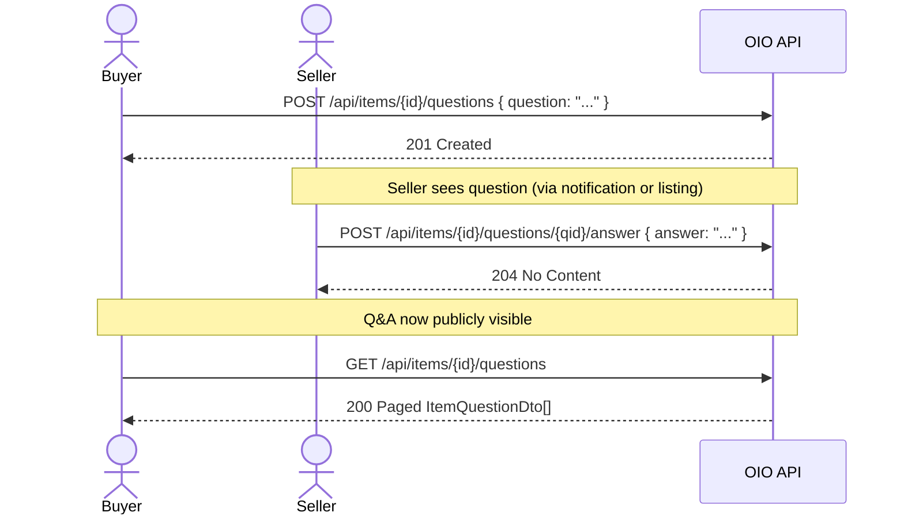

# 16-06 -- Item Q&A

## Overview

Three endpoints power the item question-and-answer system. Authenticated buyers ask questions about items, sellers (item owners) answer them, and any authenticated user can view the Q&A thread.

---

## Q&A Sequence



---

## Endpoints

### 1. List Item Questions

| Property | Value |
|----------|-------|
| Route | `GET api/items/{itemId:guid}/questions` |
| Auth | Authenticated (any user) |
| Handler | `GetPublicItemQuestionsEndpoint` -> `GetPublicItemQuestionsQueryHandler` |
| Response | `200 OK` -- Paged `ItemQuestionDto[]` |
| Errors | `404 Not Found` |

**Query Parameters:**

| Param | Type | Default | Description |
|-------|------|---------|-------------|
| `pageNumber` | int? | 1 | Page number (min 1) |
| `pageSize` | int? | 10 | Page size (max 50) |
| `sortBy` | string? | -- | Sort field (e.g. `createdAt`) |

---

### 2. Ask a Question

| Property | Value |
|----------|-------|
| Route | `POST api/items/{itemId:guid}/questions` |
| Auth | Authenticated + `AskQuestion` permission |
| Handler | `AskQuestionEndpoint` -> `AskQuestionCommandHandler` |
| Response | `201 Created` |
| Errors | `422 Validation Problem` |

**Request Body:**

```json
{
  "question": "string (required)"
}
```

---

### 3. Answer a Question

| Property | Value |
|----------|-------|
| Route | `POST api/items/{itemId:guid}/questions/{questionId:guid}/answer` |
| Auth | Authenticated (seller / item owner only) |
| Handler | `AnswerQuestionEndpoint` -> `AnswerQuestionCommandHandler` |
| Response | `204 No Content` |
| Errors | `404 Not Found` |

**Request Body:**

```json
{
  "answer": "string (required)"
}
```

---

## ItemQuestionDto

```
ItemQuestionDto(
    Guid      Id,
    Guid      AskerId,
    string    Question,
    string?   Answer,          // null until seller responds
    DateTime? AnsweredAt,      // null until answered
    bool      IsPublic,        // visibility flag
    DateTime  CreatedAt
)
```

---

## Visibility Rules

| Rule | Description |
|------|-------------|
| **Default visibility** | Questions are created with `IsPublic = true` |
| **Hide/Show** | The `ItemQuestion` entity supports `Hide()` and `Show()` methods to toggle visibility |
| **IsAnswered** | Computed property: `Answer is not null` |
| **Public listing** | Only questions where `IsPublic = true` appear in the paginated listing |

---

## Max Questions Configuration

The platform enforces a configurable limit on questions per item:

| Setting | Default | Source |
|---------|---------|--------|
| `MaxQuestionsPerItem` | 100 | `ItemConfig` section in app settings |

When the limit is reached, new `AskQuestion` commands are rejected with a validation error.

---

## ItemQuestion Entity

| Property | Type | Description |
|----------|------|-------------|
| `Id` | `ItemQuestionId` | Guid v7 |
| `ItemId` | `ItemId` | Parent item reference |
| `AskerId` | `UserId` | User who asked the question |
| `Question` | string | Question text |
| `Answer` | string? | Seller's answer (null until answered) |
| `AnsweredAt` | DateTime? | Timestamp of answer |
| `IsPublic` | bool | Visibility flag |
| `CreatedAt` | DateTime | Creation timestamp |

**Methods:**
- `Create(itemId, askerId, question, nowUtc, isPublic)` -- factory
- `AnswerQuestion(answer, now)` -- sets answer and timestamp
- `Hide()` / `Show()` -- toggle `IsPublic`

---

## Source Files

| File | Path |
|------|------|
| Endpoint (list) | `src/presentation/OIO.Api/Endpoints/AuctionContext/Items/GetPublicItemQuestionsEndpoint.cs` |
| Endpoint (ask) | `src/presentation/OIO.Api/Endpoints/AuctionContext/Items/AskQuestionEndpoint.cs` |
| Endpoint (answer) | `src/presentation/OIO.Api/Endpoints/AuctionContext/Items/AnswerQuestionEndpoint.cs` |
| ItemQuestionDto | `src/core/OIO.Application/Context/AuctionContext/DTOs/ItemQuestionDto.cs` |
| ItemQuestion entity | `src/core/OIO.Domain/Context/CatalogContext/Aggregates/Items/ItemQuestion.cs` |
| Filter params | `src/core/OIO.Application/Context/AuctionContext/Queries/GetPublicItemQuestions/GetPublicItemQuestionsFilterParameters.cs` |
| Max questions config | `src/core/OIO.Application/Abstractions/Commons/IAppConfig.cs` (ItemConfig section) |
