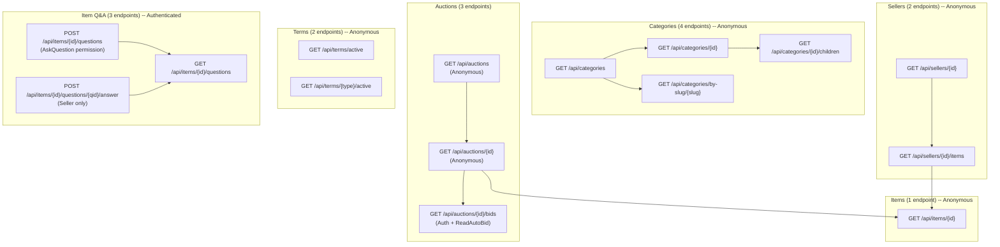

# Flow 16 -- Public & Shared Endpoints

## Overview

Public/Shared endpoints serve two audiences:

| Audience | Description |
|----------|-------------|
| **Anonymous** | No authentication required -- any visitor can call these endpoints |
| **Any authenticated user** | Requires a valid JWT but no specific role or permission beyond what is noted |

These endpoints power storefront browsing, category navigation, seller discovery, legal/terms display, and item Q&A. They are read-heavy, cache-friendly, and form the foundation every client app depends on.

> **Note:** There is no public `GET /api/items` list endpoint. Items are discovered through auction listings (`GET /api/auctions`) or seller profile pages (`GET /api/sellers/{id}/items`).

---

## Endpoint Map

---

## Full Endpoint Table

| # | Route | Method | Auth | Response |
|---|-------|--------|------|----------|
| 1 | `api/categories` | GET | Anonymous | `200` Paged `CategoryDto[]` |
| 2 | `api/categories/{categoryId}` | GET | Anonymous | `200` `CategoryDto` / `404` |
| 3 | `api/categories/by-slug/{slug}` | GET | Anonymous | `200` `CategoryDto` / `404` |
| 4 | `api/categories/{categoryId}/children` | GET | Anonymous | `200` Paged `CategoryDto[]` |
| 5 | `api/auctions` | GET | Anonymous | `200` Paged `AuctionDto[]` |
| 6 | `api/auctions/{auctionId}` | GET | Anonymous | `200` `AuctionDetailDto` / `404` |
| 7 | `api/auctions/{auctionId}/bids` | GET | Auth + `ReadAutoBid` | `200` Paged `BidDto[]` / `404` |
| 8 | `api/items/{itemId}` | GET | Anonymous | `200` `ItemDto` |
| 9 | `api/sellers/{sellerId}` | GET | Anonymous | `200` `PublicSellerProfileDto` |
| 10 | `api/sellers/{sellerId}/items` | GET | Anonymous | `200` Paged `PublicSellerItemDto[]` |
| 11 | `api/terms/active` | GET | Anonymous | `200` `TermsDocumentDto[]` |
| 12 | `api/terms/{type}/active` | GET | Anonymous | `200` `TermsDocumentDto` / `404` |
| 13 | `api/items/{itemId}/questions` | GET | Authenticated | `200` Paged `ItemQuestionDto[]` / `404` |
| 14 | `api/items/{itemId}/questions` | POST | Auth + `AskQuestion` | `201` Created / `422` |
| 15 | `api/items/{itemId}/questions/{questionId}/answer` | POST | Authenticated (seller) | `204` / `404` |

---

## Subflow Index

| File | Domain | Endpoints |
|------|--------|-----------|
| [01-categories.md](01-categories.md) | Category tree navigation | 4 |
| [02-auction-browsing.md](02-auction-browsing.md) | Auction listing & detail | 3 |
| [03-item-browsing.md](03-item-browsing.md) | Single item detail | 1 |
| [04-seller-public-profile.md](04-seller-public-profile.md) | Seller storefront | 2 |
| [05-terms.md](05-terms.md) | Legal terms & conditions | 2 |
| [06-item-qa.md](06-item-qa.md) | Item questions & answers | 3 |

---

## Key Source Files

| Area | Path |
|------|------|
| Category endpoints | `src/presentation/OIO.Api/Endpoints/AuctionContext/Categories/` |
| Auction endpoints | `src/presentation/OIO.Api/Endpoints/AuctionContext/Auctions/` |
| Item endpoints | `src/presentation/OIO.Api/Endpoints/AuctionContext/Items/` |
| Seller endpoints | `src/presentation/OIO.Api/Endpoints/UserContext/Sellers/` |
| Terms endpoints | `src/presentation/OIO.Api/Endpoints/UserContext/Terms/` |
| URL constants | `src/presentation/OIO.Api/Common/ApiEndpoint.Url.cs` |
