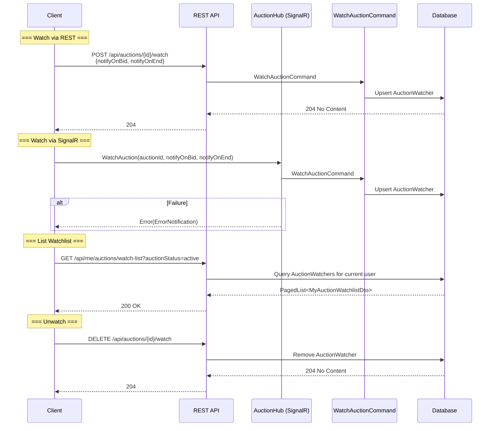

# 17-03 -- Watchlist

## Overview

Users can **watch** auctions to receive notifications and quickly access them from their dashboard. Watching can be done via REST API or SignalR (real-time). Unwatching is REST-only.

---

## Interaction Flow

---

## Endpoints

### 1. List Watchlist

| Property | Value |
|----------|-------|
| Route | `GET /api/me/auctions/watch-list` |
| Permission | `me:watchlist:read` |
| Tag | `Me` |
| Response | `PagedList<MyAuctionWatchlistDto>` |

#### Filter Parameters

| Param | Type | Description |
|-------|------|-------------|
| `auctionStatus` | `string?` | Filter by auction status (same values as `AuctionStatus`) |
| `sortBy` | `string?` | Sort expression validated against `AuctionWatcherMappings.MyAuctionWatchlistDtoSortMapping` |
| `pageNumber` | `int?` | Page number (default 1) |
| `pageSize` | `int?` | Page size (default 10, max 50) |

#### Sort Options

| Sort Key | Maps To |
|----------|---------|
| `auctionId` | `AuctionWatcher.AuctionId` |
| `itemTitle` | `AuctionWatcher.Auction.Item.Title` |
| `currentPrice` | `AuctionWatcher.Auction.Pricing.CurrentAmount` |
| `auctionStatus` | `AuctionWatcher.Auction.Status.Id` |
| `bidCount` | `AuctionWatcher.Auction.BidCount` |
| `endTime` | `AuctionWatcher.Auction.Info.EndTime` |
| `watchedAt` | `AuctionWatcher.CreatedAt` |

---

### 2. Watch Auction (REST)

| Property | Value |
|----------|-------|
| Route | `POST /api/auctions/{auctionId}/watch` |
| Permission | `auctions:watch` |
| Tag | `Auctions` |
| Response | `204 No Content` |
| Error | `409 Conflict` (already watching) |

#### Request Body

| Field | Type | Default | Description |
|-------|------|---------|-------------|
| `notifyOnBid` | `bool` | `true` | Receive notification when a new bid is placed |
| `notifyOnEnd` | `bool` | `true` | Receive notification when the auction ends |

The request body is optional. If omitted, both notification preferences default to `true`.

---

### 3. Unwatch Auction

| Property | Value |
|----------|-------|
| Route | `DELETE /api/auctions/{auctionId}/watch` |
| Permission | `auctions:unwatch` |
| Tag | `Auctions` |
| Response | `204 No Content` |

---

### 4. Watch Auction (SignalR)

| Property | Value |
|----------|-------|
| Hub | `/hubs/auction` |
| Method | `WatchAuction` |
| Permission | `auctions:watch` |
| Parameters | `auctionId: Guid`, `notifyOnBid: bool = true`, `notifyOnEnd: bool = true` |
| On failure | Calls `IAuctionHubClient.Error(ErrorNotification)` |

The SignalR method executes the same `WatchAuctionCommand` as the REST endpoint. On failure, the error is sent back to the caller via the `Error` client callback instead of an HTTP status code.

---

## MyAuctionWatchlistDto (12 fields)

| Field | Type | Description |
|-------|------|-------------|
| `auctionId` | `Guid` | Watched auction ID |
| `itemTitle` | `string` | Title of the auctioned item |
| `primaryImageUrl` | `string?` | URL of the primary image |
| `currentPrice` | `decimal` | Current highest bid amount |
| `currency` | `string` | Currency code |
| `auctionStatus` | `string` | Current auction status |
| `bidCount` | `int` | Total number of bids |
| `endTime` | `DateTime` | When the auction ends |
| `remainingTime` | `TimeSpan` | Time remaining |
| `notifyOnBid` | `bool` | Whether user receives bid notifications |
| `notifyOnEnd` | `bool` | Whether user receives end notifications |
| `watchedAt` | `DateTime` | When the user started watching |

---

## AuctionWatcher Entity

The `AuctionWatcher` entity stores the watch relationship:

| Property | Type | Description |
|----------|------|-------------|
| `Id` | `AuctionWatcherId` | Unique watcher record ID (GUIDv7) |
| `AuctionId` | `AuctionId` | The watched auction |
| `UserId` | `UserId` | The watching user |
| `NotifyOnBid` | `bool` | Bid notification preference |
| `NotifyOnEnd` | `bool` | End notification preference |
| `CreatedAt` | `DateTime` | When the watch was created |

Notification preferences can be updated via `UpdateNotificationSettings(notifyOnBid?, notifyOnEnd?)` -- null values keep the existing setting.

---

## Source References

| File | Path |
|------|------|
| List Endpoint | `src/presentation/OIO.Api/Endpoints/UserContext/Me/GetMyWatchlistEndpoint.cs` |
| Watch Endpoint | `src/presentation/OIO.Api/Endpoints/AuctionContext/Auctions/WatchAuctionEndpoint.cs` |
| Unwatch Endpoint | `src/presentation/OIO.Api/Endpoints/AuctionContext/Auctions/UnwatchAuctionEndpoint.cs` |
| SignalR Hub | `src/presentation/OIO.Api/Hubs/AuctionHub.cs` |
| Query | `src/core/OIO.Application/Context/AuctionContext/Queries/GetMyWatchlist/GetMyWatchlistQuery.cs` |
| DTO | `src/core/OIO.Application/Context/AuctionContext/DTOs/MyWatchlistDto.cs` |
| Entity | `src/core/OIO.Domain/Context/AuctionContext/Aggregates/Auctions/AuctionWatcher.cs` |
| Mappings | `src/core/OIO.Application/Context/AuctionContext/Mappings/AuctionWatcherMappings.cs` |
