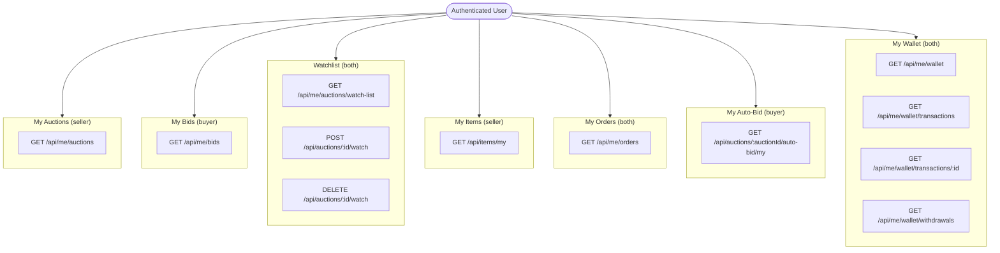

# Flow 17 -- Activity Views

## Overview

Activity Views provide authenticated users with a **dashboard-style** read of their own data across the platform. Every endpoint is scoped to the calling user (`ICurrentUser`) so one user can never see another user's private activity.

The views split into **buyer-oriented** and **seller-oriented** groups:

| Perspective | Groups |
|-------------|--------|
| **Seller** | My Auctions, My Items |
| **Buyer** | My Bids, My Auto-Bid, My Orders |
| **Both** | Watchlist, My Wallet |

---

## Architecture Map

---

## Endpoint Reference

| # | Route | Method | Permission | Filter Params | Response Type |
|---|-------|--------|------------|---------------|---------------|
| 1 | `/api/me/auctions` | GET | `me:auctions:read` | `status`, `sortBy`, `pageNumber`, `pageSize` | `PagedList<AuctionListItemDto>` |
| 2 | `/api/me/bids` | GET | `me:bids:read` | `status`, `sortBy`, `pageNumber`, `pageSize` | `PagedList<MyBidDto>` |
| 3 | `/api/me/auctions/watch-list` | GET | `me:watchlist:read` | `auctionStatus`, `sortBy`, `pageNumber`, `pageSize` | `PagedList<MyAuctionWatchlistDto>` |
| 4 | `/api/auctions/{auctionId}/watch` | POST | `auctions:watch` | -- (body: `notifyOnBid`, `notifyOnEnd`) | `204 No Content` |
| 5 | `/api/auctions/{auctionId}/watch` | DELETE | `auctions:unwatch` | -- | `204 No Content` |
| 6 | `/api/items/my` | GET | (authenticated) | `sortBy`, `pageNumber`, `pageSize` | `PagedList<ItemDto>` |
| 7 | `/api/me/orders` | GET | (authenticated) | -- | `IReadOnlyList<OrderDto>` |
| 8 | `/api/auctions/{auctionId}/auto-bid/my` | GET | (authenticated) | -- | `AutoBidDto?` (nullable) |
| 9 | `/api/me/wallet` | GET | (authenticated) | -- | `WalletSummaryDto` |
| 10 | `/api/me/wallet/transactions` | GET | (authenticated) | `type`, `from`, `to`, `pageNumber`, `pageSize` | `PagedList<WalletTransactionDto>` |
| 11 | `/api/me/wallet/transactions/{transactionId}` | GET | (authenticated) | -- | `WalletTransactionDto` |
| 12 | `/api/me/wallet/withdrawals` | GET | (authenticated) | `status`, `pageNumber`, `pageSize` | `PagedList<WithdrawalRequestDto>` |
| 13 | `/hubs/auction` | SignalR | `auctions:watch` | -- (params: `auctionId`, `notifyOnBid`, `notifyOnEnd`) | Error callback on failure |

> Endpoints 1-3 require specific permissions. Endpoints 4-5 require auction-level permissions. Endpoints 6-12 require only basic authentication (no granular permission). Endpoint 13 is a SignalR hub method.

---

## Buyer vs Seller View Distinction

- **Seller views** (`My Auctions`, `My Items`) return items where the current user is the `SellerId`.
- **Buyer views** (`My Bids`, `My Auto-Bid`) return items where the current user is the `BidderId`.
- **My Orders** returns orders where the current user is **either** the `BuyerId` or `SellerId`.
- **Watchlist** and **My Wallet** are role-agnostic -- any authenticated user can use them.

---

## Subflow Index

| # | File | Topic |
|---|------|-------|
| 1 | [01-my-auctions.md](01-my-auctions.md) | My Auctions (seller) |
| 2 | [02-my-bids.md](02-my-bids.md) | My Bids (buyer) |
| 3 | [03-watchlist.md](03-watchlist.md) | Watchlist (watch / unwatch / list) |
| 4 | [04-my-items.md](04-my-items.md) | My Items (seller) |
| 5 | [05-my-orders.md](05-my-orders.md) | My Orders (buyer + seller) |
| 6 | [06-my-auto-bid.md](06-my-auto-bid.md) | My Auto-Bid (buyer, per-auction) |
| 7 | [07-my-wallet.md](07-my-wallet.md) | My Wallet (summary, transactions, withdrawals) |
