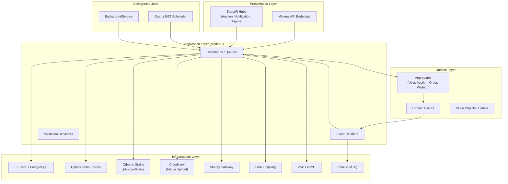

# OIO Auction Platform — Flow Documentation

Tai lieu mo ta chi tiet toan bo cac luong nghiep vu (business flows) cua he thong dau gia OIO.
Moi flow bao gom: endpoint sequence, request/response, business rules, domain events, background jobs, va Mermaid diagrams.

**Tong hop:** 151 docs, 17 Postman collections, 464 requests.

---

## Kien truc tong quan

---

## Flow Index

| # | Flow | Docs | Postman | Requests | Folder |
|---|------|------|---------|----------|--------|
| 01 | [Registration & Auth](./01-registration-auth/README.md) | 11 | [Flow1](../postman/Flow1_Registration_Auth.postman_collection.json) | 24 | `01-registration-auth/` |
| 02 | [User Profile](./02-user-profile/README.md) | 5 | [Flow2](../postman/Flow2_User_Profile.postman_collection.json) | 17 | `02-user-profile/` |
| 03 | [Seller Verification (eKYC)](./03-seller-verification/README.md) | 8 | [Flow3](../postman/Flow3_Seller_Verification.postman_collection.json) | 40 | `03-seller-verification/` |
| 04 | [Media Upload](./04-media-upload/README.md) | 6 | [Flow4](../postman/Flow4_Media_Upload.postman_collection.json) | 16 | `04-media-upload/` |
| 05 | [Item Management](./05-item-management/README.md) | 9 | [Flow5](../postman/Flow5_Item_Management.postman_collection.json) | 35 | `05-item-management/` |
| 06 | [Auction Lifecycle](./06-auction-lifecycle/README.md) | 13 | [Flow6](../postman/Flow6_Auction_Lifecycle.postman_collection.json) | 40 | `06-auction-lifecycle/` |
| 07 | [Bidding (WS + REST)](./07-bidding/README.md) | 9 | [Flow7](../postman/Flow7_Bidding.postman_collection.json) | 24 | `07-bidding/` |
| 08 | [Buy Now](./08-buy-now/README.md) | 10 | [Flow8](../postman/Flow8_Buy_Now.postman_collection.json) | 22 | `08-buy-now/` |
| 09 | [Payment & VNPay](./09-payment/README.md) | 10 | [Flow9](../postman/Flow09_Payment_VNPay.postman_collection.json) | 30 | `09-payment/` |
| 10 | [Order Lifecycle](./10-order-lifecycle/README.md) | 11 | [Flow10](../postman/Flow10_Order_Lifecycle.postman_collection.json) | 32 | `10-order-lifecycle/` |
| 11 | [Warehouse & Shipping](./11-warehouse-shipping/README.md) | 10 | [Flow11](../postman/Flow11_Warehouse_Shipping.postman_collection.json) | 34 | `11-warehouse-shipping/` |
| 12 | [Dispute & Moderation](./12-dispute-moderation/README.md) | 9 | [Flow12](../postman/Flow12_Dispute_Moderation.postman_collection.json) | 28 | `12-dispute-moderation/` |
| 13 | [Notification](./13-notification/README.md) | 6 | [Flow13](../postman/Flow13_Notification.postman_collection.json) | 14 | `13-notification/` |
| 14 | [Wallet & Withdrawal](./14-wallet-withdrawal/README.md) | 7 | [Flow14](../postman/Flow14_Wallet_Withdrawal.postman_collection.json) | 18 | `14-wallet-withdrawal/` |
| 15 | [Admin Operations](./15-admin-operations/README.md) | 12 | [Flow15](../postman/Flow15_Admin_Operations.postman_collection.json) | 56 | `15-admin-operations/` |
| 16 | [Public/Shared](./16-public-shared/README.md) | 7 | [Flow16](../postman/Flow16_Public_Shared.postman_collection.json) | 18 | `16-public-shared/` |
| 17 | [Activity Views](./17-activity-views/README.md) | 8 | [Flow17](../postman/Flow17_Activity_Views.postman_collection.json) | 16 | `17-activity-views/` |
| | **TOTAL** | **151** | **17 collections** | **464** | |

---

## Postman Setup

### Environment Variables

Import `postman/OIO_Environment.postman_environment.json` hoac tao moi voi cac bien:

| Variable | Mo ta | Vi du |
|----------|-------|-------|
| `baseUrl` | API base URL | `http://localhost:8080` |
| `accessToken` | JWT token (user) | Tu login response |
| `adminAccessToken` | JWT token (admin) | Tu admin login response |
| `auctionId` | Auction ID dang test | Auto-extracted |
| `itemId` | Item ID dang test | Auto-extracted |
| `orderId` | Order ID | Auto-extracted |
| `mediaUploadId` | Media upload ID | Auto-extracted |

### Thu tu chay

1. **Flow 1** — Register + Login → lay `accessToken`
2. **Flow 1** — Admin Login → lay `adminAccessToken`
3. **Flow 2-5** — Profile, Verification, Media, Item
4. **Flow 6-8** — Auction, Bidding, Buy Now
5. **Flow 9-10** — Payment, Order
6. **Flow 11-12** — Warehouse, Dispute
7. **Flow 13-17** — Notification, Wallet, Admin, Public, Activity

---

## Quy uoc

| Ky hieu | Y nghia |
|---------|---------|
| `Auth: Required` | Can dang nhap (Bearer JWT) |
| `Auth: Anonymous` | Khong can dang nhap |
| `Auth: Admin` | Can admin JWT (`{{adminAccessToken}}`) |
| `Permission: X` | Can quyen X |
| `Idempotent` | Co `Idempotency-Key` header |

### Mermaid Diagrams

- `flowchart` va `stateDiagram-v2`: dung **Elk layout engine**
- `sequenceDiagram`: khong dung Elk (co layout rieng)

---

## SignalR Hubs

| Hub | URL | Mo ta |
|-----|-----|-------|
| AuctionHub | `/hubs/auctions` | Bidding realtime, auto-bid, buy-now events |
| NotificationHub | `/hubs/notifications` | Push notifications, unread count |
| DisputeHub | `/hubs/disputes` | Dispute chat realtime |

---

## Background Jobs

| Job | Type | Interval | Flow |
|-----|------|----------|------|
| ExpiredSessionCleanupJob | Quartz | 6h | 01 |
| PendingUploadRelocationJob | Quartz | 15min | 04 |
| PendingUploadCleanupJob | Quartz | 15min | 04 |
| AuctionActivationJob | Quartz | per-auction | 06 |
| EndAuctionJob | Quartz | per-auction | 06 |
| AuctionPollingFallbackJob | Quartz | 1min | 06 |
| ExpireBuyNowReservationsJob | BackgroundService | 1min | 08 |
| ProcessGatewayWebhooksJob | Quartz | 10s | 09 |
| GatewayReconciliationJob | Quartz | 15min | 09 |
| CancelExpiredOrdersJob | Quartz | 5min | 10 |
| ReleaseExpiredDecisionWindowJob | BackgroundService | 10min | 10 |
| AuctionAutoCompleteJob | Quartz | per-order | 10 |
| ProcessNotificationDeliveriesJob | Quartz | 10s | 13 |
| ScanActiveAuctionsForCollusionJob | Quartz | configurable | 15 |
